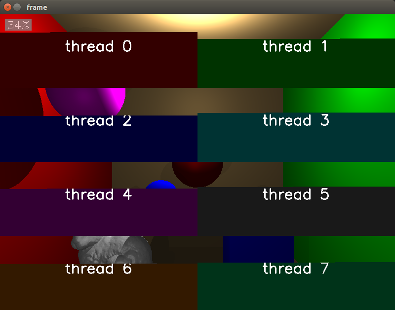
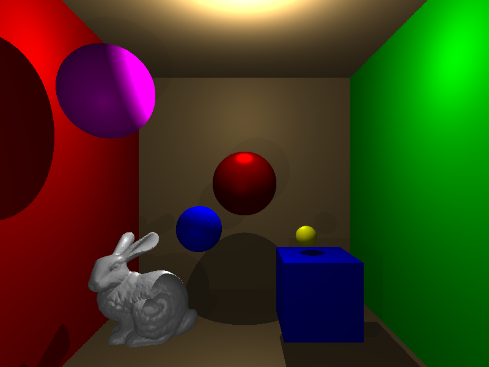
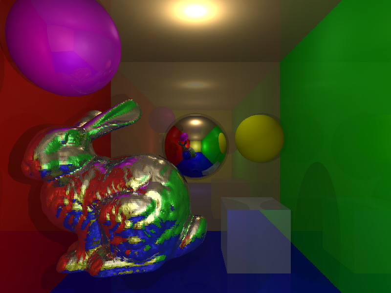

# raytracer
This is a small raytracer implemented from scratch.

Multi-threading is implemented. But only works with 8 threads so far. During rendering the progress will be showed, for each thread.
Here is an example preview image:

# Results

## 28.12.2016

22m39.197s

## 31.21.2016

29m50.990s
